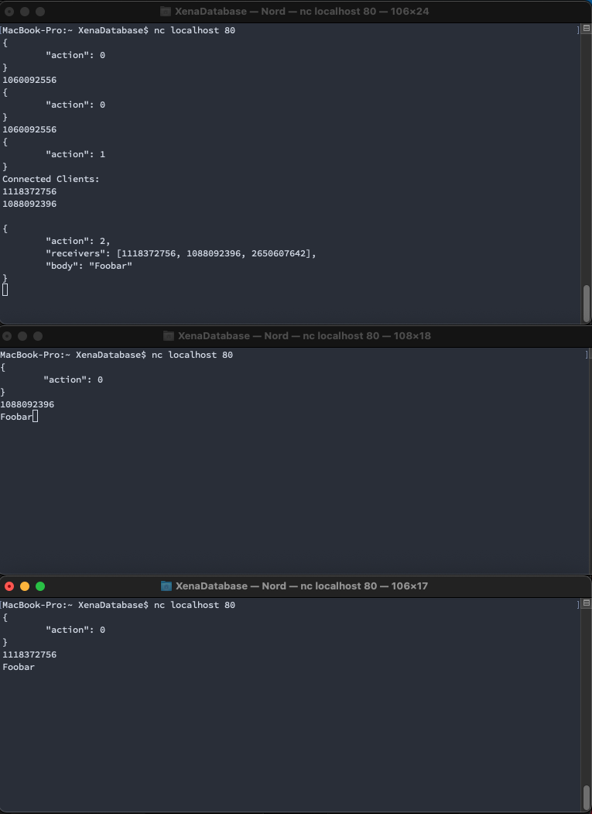

## Multiplayer Engineering: Message Delivery System

- [Overview](#overview)
- [How to run](#run)


### Overview

Tasked to design and implement a message delivery system that operates at the network layer. The system must be able to handle 3 types of messages. Identity. List. Relay which have been implemented. 

Each client that connects to a hub must be given a user_id which is of type uint64. Was not able to find a module which provided this. User id operates within uint32.


#### Hub

The implementation is a tcp server that listens on port 80 and as specified accepts all incoming connections with no auth. The accepted connection is routed through a goroutine and assigns an ID on the connection to a thread safe hashmap.


### How to run

Server is hard-coded to run on port 80

To start server type following into terminal from top directory:

```
make run
```

Communication is consumed through json format

```
{
	"action": 0
}

{
 	"action": 2,
	"receivers": [1118372756, 1088092396, 2650607642],
	"body": "Foobar"
}
```

0 - Identity Message
1 - List Message
2 - Relay message




